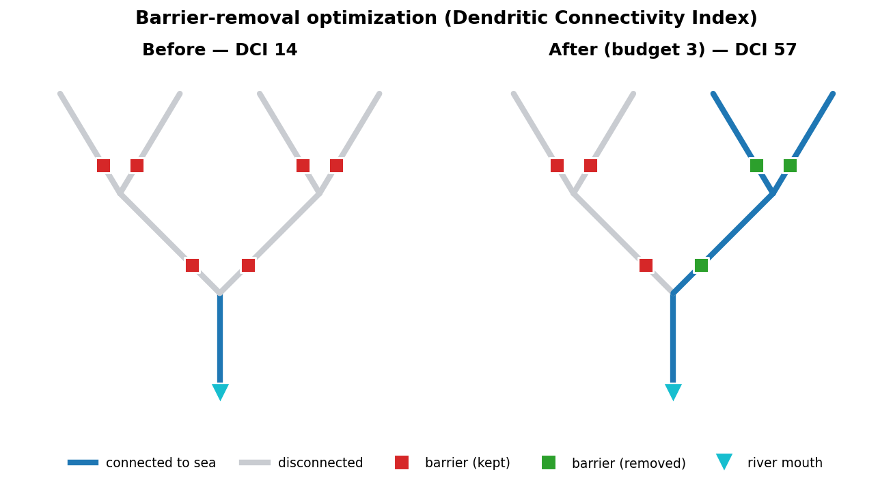
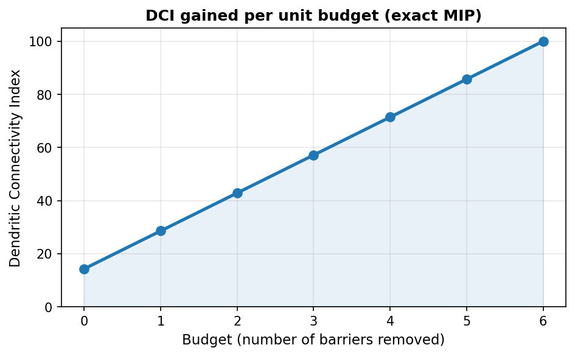

# pymarxan

Modular Python toolkit for Marxan conservation planning.


## What is this?

[Marxan](https://marxansolutions.org/) is the world's most widely used conservation planning software, helping prioritize areas for biodiversity protection. **pymarxan** is a complete Python reimplementation covering the full Marxan family — Marxan, Marxan with Zones, and Marxan with Connectivity — combined with modern exact solvers, modern conservation-planning analyses (30×30 representation, distributional equity, multi-scenario robustness), native **river-connectivity (DCI) and barrier-removal optimization**, an interactive web UI, and a modular architecture for programmatic use.

It provides a pure Python core library for headless optimization, reusable Shiny UI components, and an assembled web application — all in one package.

### ✨ River connectivity & barrier-removal optimization

Beyond classic site selection, pymarxan natively optimizes **river restoration** — *which dams, weirs, or culverts to remove, under a budget, to maximize reconnected habitat* — using the Dendritic Connectivity Index (Côté et al. 2009) with greedy, simulated-annealing, and **provably optimal** integer-programming engines.



```python
from pymarxan.rivers import RiverNetwork, BarrierProblem, optimize_barriers_mip, dci_diadromous

net = RiverNetwork(segments=..., barriers=...)   # or: from_hydrorivers(gdf)
print(dci_diadromous(net))                        # current connectivity
sol = optimize_barriers_mip(BarrierProblem(net, budget=3.0))
print(sol.removed, sol.dci_after, sol.optimal)    # the optimal set of barriers to remove
```

The budget–DCI frontier shows exactly how much connectivity each extra dollar buys:



## Quick Start

```bash
# Clone and install
git clone https://github.com/razinkele/pymarxan.git
cd pymarxan
python -m venv .venv && source .venv/bin/activate
pip install -e ".[all]"

# Launch the web app
make app
```

Then open http://localhost:8000 in your browser.

## Documentation

- **`docs/TUTORIAL.md`** — end-to-end Python API tutorial covering the
  v0.3 / v0.4 features (HiGHS backend, importance scores, alternative
  MIP objectives, connectivity metrics, portfolios, Pareto BLM
  calibration). Every code block runs in
  `tests/test_tutorial_examples.py`.
- **`docs/USER_MANUAL.md`** — Shiny app user manual.
- **`CHANGELOG.md`** — release history.
- **`docs/plans/`** — phase-by-phase design + multi-agent review docs.

## Architecture

```
pymarxan (three-layer monorepo)
├── src/pymarxan/          Core library: models, solvers, I/O, calibration, analysis
│   ├── models/            ConservationProblem & Solution dataclasses
│   ├── solvers/           SA, MIP, heuristic, II, run-mode pipeline
│   ├── zones/             Multi-zone model, zone SA/heuristic/II/MIP solvers
│   ├── connectivity/      Distance decay, penalties, circuit-theory (current-flow), smoothing
│   ├── rivers/            River-network (DCI) + barrier-removal optimization
│   ├── constraints/       Contiguity, feature contiguity, neighbor, linear, budget
│   ├── objectives/        MinSet, MaxCoverage, MaxUtility, MinShortfall
│   ├── targets/           Automatic target rules (relative, log-linear, group)
│   ├── spatial/           Grid generation, feature intersection, boundary, export
│   ├── io/                Marxan file readers/writers (binary & zone formats)
│   ├── calibration/       BLM calibration & sensitivity analysis
│   └── analysis/          Selection frequency, portfolio, equity, 30×30 representation, robustness
├── src/pymarxan_shiny/    Reusable Shiny UI modules (26 modules)
└── src/pymarxan_app/      Assembled Shiny web application
```

- **pymarxan** — Pure Python, no UI dependencies. Use it in scripts, notebooks, or pipelines.
- **pymarxan_shiny** — Shiny for Python modules: maps, calibration, solver config, results, probability, connectivity, spatial export.
- **pymarxan_app** — Wires all modules into a complete conservation planning application.

## Solvers

| Solver | Type | Zones | Description |
|--------|------|-------|-------------|
| MIP (PuLP/CBC) | Exact | ✗ | Mixed Integer Programming — guaranteed optimal |
| Zone MIP | Exact | ✓ | Multi-zone MIP with zone costs, contributions, targets |
| Simulated Annealing | Heuristic | ✗ | SA with 4 cooling schedules (adaptive, geometric, linear, logarithmic) |
| Zone SA | Heuristic | ✓ | Multi-zone SA with zone boundary costs |
| Greedy Heuristic | Heuristic | ✗ | 8 scoring modes (HEURTYPE 0-7) |
| Zone Heuristic | Heuristic | ✓ | Greedy zone assignment minimizing zone objective |
| Iterative Improvement | Heuristic | ✗ | 4 refinement modes (ITIMPTYPE 0-3) |
| Zone II | Heuristic | ✓ | Zone-aware removal/addition/swap refinement |
| Marxan C++ Binary | Heuristic | ✗ | Wraps the original Marxan executable |
| Run Mode Pipeline | Pipeline | ✓ | Chains solvers per Marxan RUNMODE 0-6 (binary & zone) |

## Key Features

### Marxan Core
- Full Marxan parameter support (BLM, SPF, MISSLEVEL, RUNMODE, etc.)
- Classic output files (best solution, summary, selection frequency, missing values)
- Boundary Length Modifier calibration

### Marxan with Zones
- Multi-zone planning with zone costs, contributions, and targets
- Zone boundary costs between zone pairs
- All solver types available for zone problems

### Connectivity
- Symmetric and asymmetric connectivity penalties
- Distance decay functions (exponential, power-law, threshold)
- MIP linearization (binary-AND for symmetric, directed for asymmetric)
- Zone-aware connectivity (same-zone bonus)
- Circuit-theory (current-flow / effective-resistance) connectivity from a resistance raster
- Mass-conserving distribution smoothing via a dispersal kernel

### River connectivity & barrier restoration (`pymarxan.rivers`)
- `RiverNetwork`: rooted river tree (downstream-pointer encoding) with cached
  pure-NumPy topology — no extra graph dependency
- **Dendritic Connectivity Index** (Côté et al. 2009): `dci_diadromous`
  (sea↔segment), `dci_potamodromous` (all within-network pairs), per-segment
  connectivity
- Barrier-removal optimization under a budget and locked-in/out barriers:
  `optimize_barriers_greedy`, `optimize_barriers_sa` (partial passability), and
  an exact `optimize_barriers_mip` for the binary-passability diadromous case
- GIS ingest: `from_hydrorivers` (HydroRIVERS / NHDPlus GeoDataFrames) and
  `snap_barriers` (snap barrier points to nearest segment)

### Probability
- Three probability modes:
  - Mode 1: risk premium weighted by cost
  - Mode 2: persistence-adjusted feature amounts
  - Mode 3: Marxan-faithful Z-score **chance constraints** (PROB2D, per-feature
    probability targets)
- Integrated in SA, heuristic, and MIP solvers

### Modern conservation planning
- 30×30 / GBF area-based **representation** reporting against a policy threshold
- Distributional **equity** analysis (per-group totals/shares + Gini coefficient)
- Automatic **target-setting** rules (relative, IUCN-style log-linear, per-group)
- Multi-scenario **robustness** (minimax-regret no-regrets plan selection)

### Constraints
- **Contiguity**: selected PUs must form a connected subgraph (MIP network flow)
- **Feature contiguity**: PUs contributing to a feature must be connected
- **Minimum neighbors**: each selected PU needs ≥ k selected neighbors
- **Linear constraints**: soft (penalty) and hard (feasibility) modes
- **Budget**: convenience wrapper for cost-cap constraints

### Objectives
- **MinSet** (default): minimize cost meeting all targets
- **MaxCoverage**: maximize feature representation within a budget
- **MaxUtility**: maximize total conservation value within a budget
- **MinShortfall**: minimize total shortfall across all features

### Spatial Data Preparation
- Planning unit grid generation (square, hexagonal) with clipping
- Feature intersection from vector/raster layers
- Boundary generation from PU geometry
- GeoPackage and Shapefile export
- Raster cost surface import

### Portfolio Analysis
- Selection frequency across multiple runs
- Summary statistics (cost, boundary, objective distributions)
- Gap-tolerance-based solution filtering

## Development

```bash
make test        # Full test suite with coverage
make test-fast   # Skip slow SA tests (~15s)
make lint        # Ruff linter
make types       # mypy type checker
make check       # All of the above
make docs        # Generate API docs with pdoc
```

### Warnings

`pymarxan` emits `UserWarning` from `ProblemCache.from_problem` and from
`read_spec` to flag no-op configurations (e.g. SEPDISTANCE on a
geographic CRS, or `sepnum > 1` with `sepdistance == 0`) and `spec.dat`
column typos (`sepnnum`, `targt2`, `ptraget`, `clumptpe`, ...).

Users running with `python -W error` or pytest `filterwarnings =
error::UserWarning` should filter pymarxan warnings explicitly so they
surface as warnings rather than exceptions:

```python
import warnings
warnings.filterwarnings("always", category=UserWarning, module="pymarxan")
```

## Docker

```bash
make docker
# or
docker compose up --build
```

The app will be available at http://localhost:8000.

## License

MIT
